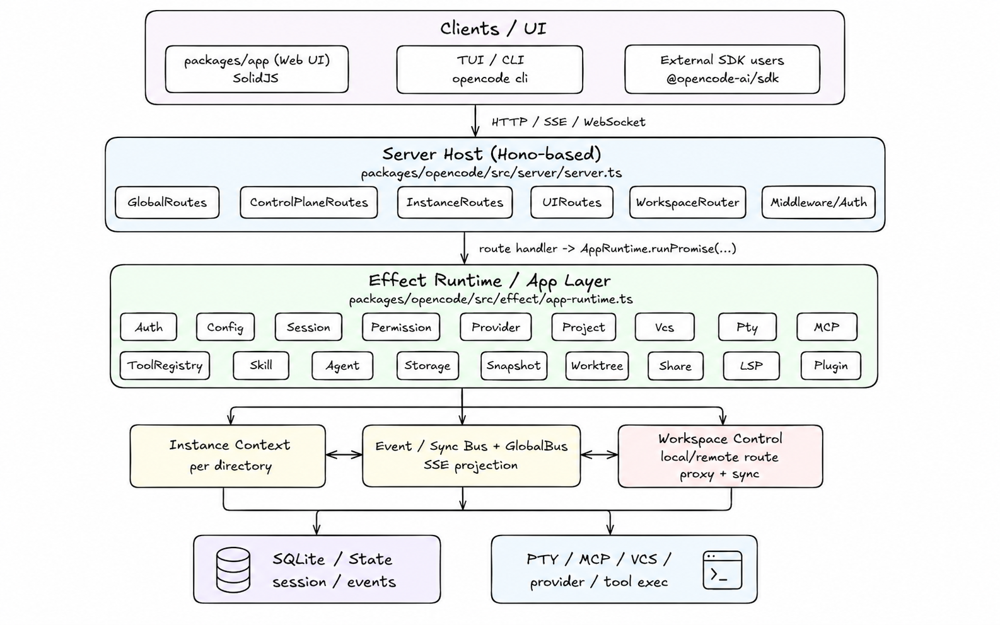

>opencode version: 1.14.22


# 整体架构




### client server传输方式

opencode支持三类传输接口

- HTTP

  普通API调用

- SSE

  事件订阅

- WebSocket

  少数实时双向场景，比如PTY终端连接


实际上，对于最常用的本地TUI调用，其采用的是自己实现的一个RPC来进行UI thread和worker thread的通信


# Tool

```txt
  - invalid：占位/兜底工具，明确标注为不要使用。
  - question：向用户发起问题并等待回答。仅在特定客户端或启用开关时注册。
  - bash：执行 shell 命令。
  - read：读取文件或目录内容，支持按行范围读取。
  - glob：按 glob 模式搜索文件路径。
  - grep：按正则搜索文件内容。
  - edit：基于精确文本匹配做局部替换。
  - write：直接写入整个文件内容。
  - task：启动或恢复一个子 agent 的子 session，让其独立完成任务并返回结果。
  - webfetch：抓取网页内容，并以 text、markdown 或 html 返回。
  - todowrite：更新 todo 列表状态。
  - websearch：执行联网搜索，返回网页搜索结果。
  - codesearch：搜索外部代码、API、SDK、文档上下文。
  - skill：加载某个 skill 的完整说明和工作流内容。
  - apply_patch：通过 patch 文本批量修改文件。
  - lsp：调用语言服务器能力，如符号、定义、引用等。仅在开启实验开关时注册。
  - plan_exit：结束 plan 模式，并请求切换到 build agent 开始实现。仅在 CLI 且开启实验计划模式时注册
```

下面仅挑选一些不太好理解的工具进行详细说明


### bash

bash命令的执行流程可以分为以下几步：

1. 解析命令AST，得到AST语法树，从AST中提取出每个命令以及命令的参数

2. 提取命令模式

   比如有命令

   ```shell
   git commit -m "msg"
   ```

   其就会被解析成`git commit *`, 这样就能统一使用`git commit *`的权限

3. 提取命令路径

   对于命令设计到的路径，需要检查路径是不是在当前工作区之外

4. 如果涉及工作区外目录，单独申请`external_directory`权限

5. 对于提取出的命令模式，进行权限判断，分为三种

   - allow
   - deny
   - ask

6. 执行命令


### task

**流程**

`task`工具用于委派子Agent来具体执行某个任务，其具体流程如下：

1. 当前agent调用`task`工具，并传入`description`, `prompt`, `subagent_type`， `task_id(可选)`, `command(可选)`
2. `task`做权限检查，检查
   - 是否允许把这个任务委派给这个`subagent_type`
   - `subagent`是否具备`task`和`todowrite`权限，用于决定子session里要不要继续允许这些能力
3. 如果传入了`task_id`, 恢复`task_id`对应的已有`session`, 如果没有，创建新的子`session`
4. `task`读取当前父上下文的`assistant message`, 并决定子任务使用什么模型
5. `task`将用户的输入解析为结构化输入，将其作为子`session`的输入，子`agent`在子`session`中独立运行
6. 子任务执行完成之后，`task`从子session的结果中提取出最终文本输出，并将其包装为`task tool`的返回值


**触发场景**

1. 当前agent在普通对话中主动进行任务拆分，调用`task`工具
2. `slash command`被包装成了一个`subtask`, `AgentLoop`中发现`subtask`, 使用`task`来委派子Agent解决这个`Task`
3. prompt中使用@引用了某个agent, 使用`task`委派指定agent执行


### todowrite

`todowrite`工具用于维护`session`中的`todo`列表，每个`session`都有一个`todo`列表


### apply_patch

`apply_patch`工具用于批量、结构化修改文件，相比于`edit`的按字符串替换, 它更适合一次提交多个文件，多处改动

该工具主要是为了适配`gpt`系列模型


### skill

`skill`工具接受一个给定skill的名字，将其的

- SKILL.md
- skill的目录
- 最多10个skill下面的文件列表

加载到当前上下文


| Agent | 能否使用 skill 工具 |
  |---|---|
  | build | 是 |
  | plan | 是 |
  | general | 是 |
  | explore | 否 |
  | compaction | 否 |
  | title | 否 |
  | summary | 否 |


**skill是如何暴露的**

- 当opencode启动时，会直接扫描.opencode, .claude目录下的所有skills目录，将每一个skill的

  - name
  - description
  - localtion
  - skill.md

  加载到内存

- 对具体的Agent, 其在自己的AgentLoop启动时，会根据自己的权限过滤skills，将权限内的skills

  放到system prompt中

- 为模型提供了skill工具，如果模型觉得当前轮次值得调用skill, 就会主动调用skill


# Agent

## Agent种类

- `agent.ts`中定义了系统中的所有agent, 内置的`agent`在代码中写死了， 而用户自定义的`agent`则通过配置文件传入

- 可以使用`opencode agent list`命令查看目前`opencode`支持多少agent

```txt
build (primary)
compaction (primary)
explore (subagent)
general (subagent)
plan (primary)
summary (primary)
title (primary)
duplicate-pr (primary)
translator (subagent)
triage (primary)
```

> 注: `opencode agent list`默认会输出每个`agent`的权限, 可以使用下面的命令进行过滤
>
> ```bash
> opencode agent list | grep -E '^[a-zA-Z0-9_-]+'
> ```

- primary

  primary表示系统的主agent, 共包含6个主agent

  - build
  - plan
  - compaction
  - title
  - duplicate-pr （未实用）
  - triage （未实用）

- subagent

  subagent表示系统的子agent, 共包含3个子agent

  - explore
  - general
  - translator （未实用）


在目前的实现中，以下四种agent有自己的身份提示词:

  - explore -> prompt/explore.txt
  - compaction -> prompt/compaction.txt
  - title -> prompt/title.txt
  - summary -> prompt/summary.txt


## Agent编排

在OpenCode中, 主Agent通过使用`task`工具来创建并将任务委派给子Agent

OpenCode支持嵌套Agent, 但是其并不是任意子Agent都能嵌套创建孙Agent, 其通过是否给子Agent暴露`task`工具来控制

| Agent      | 能委派的 Agent   | 可以被哪些 Agent 委派 |
| ---------- | ---------------- | --------------------- |
| build      | general, explore | 无                    |
| plan       | general, explore | 无                    |
| general    | general, explore | build, plan, general  |
| explore    | 无               | build, plan, general  |
| compaction | 无               | 无                    |
| title      | 无               | 无                    |
| summary    | 无               | 无                    |


## Agent消息传递

**父Agent → 子Agent**

父Agent通过调用`task`工具，来创建子Agent, 并进行消息传递，具体如下：

1. 父Agent调用`task`， 传递以下参数

   - descripton

   - prompt

     交给子Agent的任务文本

   - subagent_type

     要创建的子Agent类型

   - task_id(可选)

   - command(可选)

2. `task`创建/恢复子session

   - 如果没有`task_id`，那么会新建一个子session

3. 父Agent的原始prompt被解析成parts

   - 纯文本被解析成text part
   - 文件引用被解析为file part
   - agent引用被解析为agent part

4. 整个各种信息，在子session中拼装成一个user message, user message包括

   - sessionID
   - agent
   - model
   - tools
   - system
   - format
   - parts

简单来说，可以分为以下几步

1. 调用`task`
2. 将`prompt`解析成结构化`parts`
3. 在子session中创建一条新的user message
4. 这条user message连同agent/model/tools配置一起，作为子Agent的输入


**子Agent→父Agent**

当父Agent调用完`task`工具之后，会从`task`的返回结果中获取到子Agent的执行结果

具体可以分为以下几步：

1. 父Agent发起task
2. 子Agent在child session里边执行
3. 子Agent执行结束，结果被包装成父session中的一条task工具输出
4. 父Agent在AgentLoop中，从自己的session读取到这条工具输出


**消息共享隔离**

- 父子Agent都有自己的session, 他们的消息列表是隔离的
- 父子Agent操作同一个工作区，他们在文件系统上是共享的


## Agent属性

opencode中的每个agent均有一个info字段，表示该agent的功能与职责

```txt
// agent.ts# 27
 - name: string
    agent 的名字，唯一标识。比如内置的 build、plan、explore。
  - description?: string
    agent 的说明文字，告诉系统或用户“这个 agent 是干什么的”。
  - mode: "subagent" | "primary" | "all"
    agent 的使用模式。
    primary 表示主 agent，
    subagent 表示只能作为子 agent，
    all 表示两种场景都能用。
  - native?: boolean
    是否为系统内置 agent。内置的一般是代码里直接定义的，不是用户自定义的。
  - hidden?: boolean
    是否隐藏。隐藏的 agent 通常不会作为普通可见候选项展示，比如内部用途的 title、summary、
    compaction。
  - topP?: number
    LLM 采样参数之一，控制输出随机性范围。
  - temperature?: number
    LLM 采样温度，越高通常越发散，越低通常越稳定。
  - color?: string
    UI 展示相关的颜色配置，主要给 TUI/界面层使用。
  - permission
    这个 agent 的工具权限规则集。这是很核心的字段，决定它能不能 read、edit、bash、question、
    plan_enter 等。
  - model?: { modelID; providerID }
    指定这个 agent 默认绑定的模型和 provider。也就是它优先用哪个模型跑。
  - variant?: string
    agent 的变体标识。更像一层扩展配置，用于区分不同风格或版本。
  - prompt?: string
    agent 的系统提示词。比如 explore 会挂专用 prompt，让它偏向代码探索。
  - options: Record<string, any>
    扩展选项槽。给 agent 放额外配置，用于未来扩展或插件注入。
  - steps?: number
    限制 agent 可执行的步骤数，通常用于约束任务规模或推理轮数。
```


## 多Agent并发控制

opencode并没有事务机制，无法做到严格的并发保护，但是其做了一些局部的保护机制

1. edit文件级串行化

   edit工具对同一个文件会添加锁，同一进程里多个`edit`改同一个文件会串行执行


主Agent不会并行执行，系统中最常见的情况是`general Agent`并行执行，他们可以同时操作工作区


**提示词约束**

- `task`工具的描述建议“launch multiple agents concurrently whenever possible", 所以其本质上鼓励委派尽可能多的子Agent


总的来说，opencode中，通过提示词鼓励llm多调用`task`工具创建更多的子Agent（general agent), 这些子Agent在build模式下都有写权限，可以并发写，但是opencode通过给`edit`工具设计了文件级别的锁来做到单文件只能串行写，此外`write`工具本质上也是一个单文件操作，其没有锁限制。


# 上下文

在AgentLoop中，最终送给LLM的上下文分为两步， 

第一步，先将各种结构化信息进行组装，传递给`handle.process`, 代码位于`prompt.ts`

第二部，将传递进来的结构化信息以及各种配置参数，在`message-v2.ts`中封装成`ModelMessage[]`， 最后，使用`vercel ai sdk`，传递给`llm`


### 1. system prompt

这部分由两层进行拼接

- agent.prompt

  当前`agent`自己的系统提示词, 如果没有，就退回`provider`默认的prompt

  - explore agent: `explore.txt`
  - title agent: `title.txt`
  - compaction agent: `compaction.txt`
  - title agent: `title.txt`

  其余的agent使用`provider`默认提示词，具体来说，如果是Anthropic家的模型，就会加上`Anthropic.txt`, 其它的同理


- input.system

  运行时附加的系统信息，主要包括

  - environment

    内容包括：

      - 当前模型名和 provider/model ID
      - working directory
      - workspace root
      - 当前目录是不是 git repo
      - 平台
      - 今天日期

  - skills

      1. 判断当前 agent 是否允许 skill
      2. 如果允许，列出当前 agent 可用的 skills
      3. 拼成一段文本，告诉模型：
          - skills 是什么
          - 什么时候该用 skill 工具
          - 当前有哪些 skills 可用

    也就是说，仅展示当前agent可见的skills目录

  - instructions

    AGENTS.md中的内容

    

  

### 2. messages

当前session的历史消息，是`ModelMessage`类型数组，共有三种

- user 

  包含

  - 用户原始文本
  - synthetic text, 也就是系统自动插入的一些说明
  - 文件展开之后的文本
  - 某些附件/媒体引用

  ```json
   {
      role: "user",
      parts: [
        { type: "text", text: "..." },
        { type: "file", url: "...", mediaType: "image/png" }
      ]
    }
  ```

  


- assistant

  包含

  - assistant 普通文本

  - reasoning 内容

    ```json
      {
        role: "assistant",
        content: [
          { type: "reasoning", text: "..." },
          { type: "text", text: "..." }
        ]
      }
    ```

    

  - 工具调用请求

    ```json
      {
        role: "assistant",
        content: [
          {
            type: "tool-call",
            toolCallId: "call-1",
            toolName: "bash",
            input: { cmd: "ls" }
          }
        ]
      }
    ```

    


- tool

  包含

  - 工具调用结果

  ```json
    {
      role: "tool",
      content: [
        {
          type: "tool-result",
          toolCallId: string,
          toolName: string,
          output: ...
        }
      ]
    }
  ```

  


### 3. tools

当前这一轮真正暴露给模型的工具集合，是经过筛选之后的结果，具体包含5重筛选依据：

- 当前agent
- 当前model
- session权限
- user message的tools开关
- registry条件


### 4. toolChoice

如果当前是结构化输出场景，会要求模型必须走工具输出，否则通常不强制


### 5. model parameters

模型调用相关的参数

- temperature
- topP
- topK
- maxOutputTokens
- ...


### 6. 特殊提醒消息

- MAX_STEPS提醒

  如果当前已经达到agent的最大step, 还会额外向messages里边插入一个MAX_STEPS提醒，要求模型尽快收尾


# Messages

opencode对上下文中的Message做了比较高的抽象

```ts
export type Info = User | Assistant
export type Part =
  | TextPart
  | SubtaskPart
  | ReasoningPart
  | FilePart
  | ToolPart
  | StepStartPart
  | StepFinishPart
  | SnapshotPart
  | PatchPart
  | AgentPart
  | RetryPart
  | CompactionPart

export type WithParts = {
  info: Info
  parts: Part[]
}
```

- Info

  是User和Assistant的联合类型，记录了这条消息的元数据, 比如

  ```txt
    - id
    - sessionID
    - role: "user"
    - time
    - agent
    - model
    - system
    - tools
    - format
  ```

- Part

  记录了这条消息的内容，是一个数组，每一个part都被进行了封装

- WithParts

  表示一条完整的消息


# 上下文压缩

### 触发时机

有两个触发时机

1. AgentLoop中如果最后一条已经完成的assistant message不是summary, 并且token已经超阈值
2. SessionProcessor明确返回"compact", 此时会向user message写入一条`compaction part`


### 执行时机

- AgentLoop本身是串行执行的，其在AgentLoop中会从历史消息中查找`compaction part`

- 如果有的话，会在后台执行压缩任务
- AgentLoop会等待压缩任务完成，才会继续向后执行


### 压缩策略

  1. 找到最近一次成功完成的 compaction 对，取出其中 assistant summary 文本，记为 previousSummary。
  2. 将这对旧 compaction 消息从本轮压缩输入中排除，但不从 session 历史里物理删除。
  3. 在剩余历史上切分 head/tail：head 用于本轮压缩，tail 作为最近原始上下文保留。
  4. 使用 compaction agent，以 previousSummary 为 anchor，并结合 head 和固定摘要模板，生成一版更新后的 summary


> 这么做和直接每轮将历史划分为head/tail, 然后压缩head相比，有什么好处？
>
> - 首先将现有方法称作方案A, 将直接划分head/tail压缩head的方案称作方案B
>
> - 方案A会显示提取历史summary, 然后引导compaction让其在历史summary上做增量更新
>
>   方案B则是直接将旧summary当做普通历史记录，需要模型自己领悟这是旧状态
>
> - 也就是说，一个做到了显示引导，一个需要靠大模型自己推断


# Session

Session是OpenCode中所封装的一个概念，具体到任务中，每次打开OpenCode TUI, 一个新的session被创建，每次关闭OpenCode TUI, 当前session结束，其具体在`packages/opencode/src/session/session.ts`被封装

```txt
 Session
    ├─ User Message
    │   ├─ text part
    │   ├─ file part
    │   └─ subtask part
    ├─ Assistant Message
    │   ├─ reasoning part
    │   ├─ text part
    │   ├─ tool part
    │   ├─ patch part
    │   ├─ step-start part
    │   └─ step-finish part
    └─ ...
```


# Command


# 权限设计

## 写工具权限

| Agent      | edit | write | 说明                                              |
| ---------- | ---- | ----- | ------------------------------------------------- |
| build      | 是   | 是    | 默认主 agent，完整编辑能力                        |
| plan       | 受限 | 是    | edit 默认只允许改 plan 文件，不允许随便改业务代码 |
| general    | 是   | 是    | 通用子 agent，可执行实现类任务                    |
| explore    | 否   | 否    | 只读探索 agent                                    |
| compaction | 否   | 否    | 内部 agent                                        |
| title      | 否   | 否    | 内部 agent                                        |
| summary    | 否   | 否    | 内部 agent                                        |


# AgentLoop

核心源码位于`/root/projects/opencode/packages/opencode/src/session/prompt.ts#1308` `runloop`函数中

整体的伪代码如下：

```txt
while True:
    1. 获取当前session的信息历史消息
    2. 从历史消息中找到:
        - 最近一条user message
        - 最近一条assistant message
        - 最近一条已经finish的assistant message
        - 还没有处理的compaction/subtask parts
    3. 如果当前轮次已经没有工具调用，那么直接break
    4. 如果是第一轮，生成session标题
    5. 查看当前还有未完成的子任务以及压缩任务，等待他们完成
    6. 如果上下文快满了，创建压缩任务（异步执行）
    7. 插入Reminder prompt, 包含
        - 如果当前agent 是plan模式，那么会注入PROMPT_PLAN
        - 如果当前agent 是build模式，那么会注入BUILD_SWITCH
        - 如果agent已经达到最大step, 那么会注入MAX_STEPS， 提醒模型给出最终答案
    8. 根据各种权限配置，解析本轮可用的工具
    9. 构造system prompt, messages
    10. 使用processor处理LLM流式事件
        - 记录text/reasoning delta
        - 记录tool调用状态
        - 更新token/cost
        - 检测 overflow / error /retry
    11. process返回三种事件：stop, continue, compact
        - stop: 结束循环
        - continue: 继续下一轮循环
        - compact: 上下文太大，创建一个异步compaction任务，然后再进入下一轮循环

Loop结束，返回assistang message
```


总的来说，可以分为四步：

1. 读取session状态

   从当前session里边读取最近的user, assistant消息，未处理的子任务以及压缩任务

2. 处理子任务以及压缩任务

3. 上下文检测，如果上下文快满了，创建一个压缩任务，用于下一轮执行

4. 装配reminder, system prompt, messages数组，进行LLM推理，输出一个结果, 有三种
   - stop
   - continue
   - compact
5. 根据模型结果决定下一步执行


## LLM调用

LLM的调用采用的是流式驱动，其在流式消费LLM输出的时候，会边消费边处理事件：

- text-delta: 实时追加文本
- reasoning-delta: 实时追加reasoning
- tool-input-start / tool-call: 一旦stream中出现工具调用，就立即记录并进行工具执行状态
- tool-result / tool-erro: 工具执行完成之后，将结果写回assistant message


